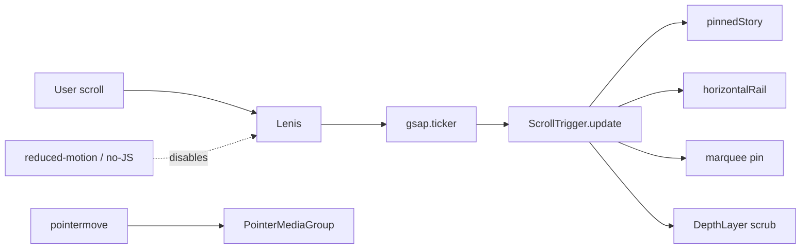

# Motion Smoothness Implementation Spec (Lenis + Depth + Scroll-Jack)

## Status

Approved implementation spec. Intended to be executed by an implementation agent without further discovery. It supersedes the "no Lenis" clause of ADR 0007 (see the ADR task at the end).

## Problem

Three recurring symptoms, all rooted in native scroll driving GSAP and in under-built motion primitives:

1. **Pointer-follow is too weak and has no real depth.** `PointerMediaGroup.astro` multiplies a normalized `[-0.5, 0.5]` pointer position by a small pixel `data-pointer-depth` (max travel is only `±depth` px, and only at the extreme edges of the scope), and uses the **same** `0.5s` lag for every layer. Result: images barely move, never sweep across the section over the adjacent text, and never separate into distinct depth planes. Scroll-driven parallax (the "Depth Layer" primitive #7 in the motion-language spec) is **specified but never built in production** (it only exists in the throwaway `prototype/MotionLanguagePrototype.astro`).
2. **Scroll-jack is janky on enter/release.** `pinnedStory.ts` uses `scrub: true` (no lag), no `anticipatePin`, and native scroll fires irregular events, so pins "catch" on enter and release.
3. **Page scroll is inconsistent across pages.** Native scroll, no momentum smoothing; scrub/parallax read as steppy because the scroll signal itself is choppy.
4. **Marquee never completes its travel before scroll continues.** `Marquee.astro` is scroll-linked across `top bottom → bottom top` (`scrub: 0.5`), so its `xPercent` is tied to the section passing through the viewport and it never runs its full travel.

## Current-state facts (verified)

- Stack already installed (`apps/web/package.json`): `gsap@^3.15.0`, `lenis@^1.3.25`, `split-type@^0.3.4`.
- Production motion library: `apps/web/src/lib/motion/` = `config.ts` (tokens), `splitText.ts`, `reveal.ts`, `hover.ts`, `loading.ts`, `routeTransition.ts`, `pinnedStory.ts`, `bootstrap.ts`, `index.ts`.
- `initMotion()` is called in `apps/web/src/layouts/Layout.astro` (~line 50).
- Pointer-follow exists: `apps/web/src/components/PointerMediaGroup.astro`; used by `blocks/HomeFeature.astro` (`data-pointer-depth="70"` / `"35"`) and `who-we-are/WhoWeAreIntro.astro` (`data-pointer-depth="30"`).
- Vertical scroll-jack exists: `pinnedStory.ts`, wired into `blocks/Capes.astro` (`scrub: 0.5`).
- Horizontal rail is native `overflow-x` scroll (NOT scroll-jacked): `PinnedHorizontalRail.astro`.
- Lenis is currently used **only** in `components/prototype/MotionLanguagePrototype.astro` (cinematic variants), where it is synced to `gsap.ticker` and `ScrollTrigger.update` — this is the reference pattern to promote.
- Conflicting approved docs that must be reconciled: `docs/adr/0007-gsap-only-no-smooth-scroll.md` ("no Lenis", but explicitly "not a one-way door") and `docs/design-system/motion-language-implementation-spec.md` ("Do not use Lenis" + migration step "Remove Lenis").
- Next ADR number is **0021** (current max is 0020).

## Decisions (locked)

- **Adopt Lenis globally**, synced to `gsap.ticker`, feeding `ScrollTrigger.update`, with `gsap.ticker.lagSmoothing(0)`. Disabled under `prefers-reduced-motion` and no-JS; native scroll remains the fallback.
- **Pointer parallax relationship = Option A (classic depth illusion):** the front layer sweeps **more** and **snappier** (less lag); the deeper layer travels **less** and **lags more**, sits behind with a resting offset. Depth/offset magnitudes are tuned **strong** and are calibrated against reference screenshots (see "Calibration").
- Cover **both** vertical pin smoothness **and** horizontal rails, **plus** the marquee.
- Build the Depth Layer primitive **once** and apply to the Figma-spec'd set: `HomeFeature`, "Built for brands" media, Zine editorial/parallax block, pinned-story chapter media.
- Capture as **ADR 0021 + this spec doc + an amendment to the motion-language "no Lenis" rule**.

## Scroll pipeline



## Global non-negotiables (carry forward existing system rules)

- Every timeline/ScrollTrigger is created inside `gsap.matchMedia()` with a `(prefers-reduced-motion: no-preference)` query and an explicit teardown.
- Animate transforms/opacity/clip-path/CSS vars only. Never animate `top/left/width/height/margin/padding`.
- Each component provides a teardown on `pagehide`; kill ScrollTriggers, revert SplitText, remove listeners.
- Reduced-motion / no-JS: final visible state, native scroll, static layouts.

## Implementation

### 1. New `apps/web/src/lib/motion/smoothScroll.ts`

Responsibilities:

- Create a singleton `Lenis` instance and drive it from GSAP's ticker.
- No-op under reduced-motion / no-JS (leave native scroll intact).
- Sync anchors and preserve back/forward sanity.

Sketch:

```ts
import gsap from 'gsap';
import { ScrollTrigger } from 'gsap/ScrollTrigger';
import Lenis from 'lenis';
import { prefersReducedMotion } from './config';

gsap.registerPlugin(ScrollTrigger);

let lenis: Lenis | null = null;

export function initSmoothScroll(): () => void {
  if (prefersReducedMotion()) return () => {};
  if (lenis) return () => {};

  if ('scrollRestoration' in history) history.scrollRestoration = 'manual';

  lenis = new Lenis({ lerp: 0.1, smoothWheel: true });
  lenis.on('scroll', ScrollTrigger.update);

  const raf = (time: number) => lenis?.raf(time * 1000);
  gsap.ticker.add(raf);
  gsap.ticker.lagSmoothing(0);

  // Anchor links -> Lenis scrollTo; respect data-lenis-prevent on scrollable overlays.
  const onAnchorClick = (event: MouseEvent) => {
    const anchor = (event.target as HTMLElement)?.closest<HTMLAnchorElement>('a[href^="#"]');
    if (!anchor) return;
    const id = anchor.getAttribute('href');
    if (!id || id === '#') return;
    const target = document.querySelector<HTMLElement>(id);
    if (!target) return;
    event.preventDefault();
    lenis?.scrollTo(target);
  };
  document.addEventListener('click', onAnchorClick);

  return () => {
    document.removeEventListener('click', onAnchorClick);
    gsap.ticker.remove(raf);
    lenis?.destroy();
    lenis = null;
  };
}

export function getLenis(): Lenis | null {
  return lenis;
}
```

Notes:
- `lerp: 0.1` is the global default; expose as a token in `config.ts` so it is tunable. The prototype used `0.075` for cinematic and `0.12` for lighter; `0.1` is a reasonable production default.
- Add `data-lenis-prevent` to any independently scrollable overlay (menu panel, modal) so nested scroll works.
- On route change, reset scroll to top (Route Transition uses full page nav, so a fresh load resets naturally; the `scrollRestoration = 'manual'` line prevents the browser fighting the entry animation).

Export from `apps/web/src/lib/motion/index.ts`.

### 2. `apps/web/src/layouts/Layout.astro`

- Call `initSmoothScroll()` **before** `initMotion()` so the ticker/`ScrollTrigger.update` wiring is in place before any ScrollTrigger is created.
- Add a `pagehide` teardown for the returned cleanup.

### 3. `apps/web/src/lib/motion/config.ts`

Add tunable tokens:

```ts
export const SCROLL = {
  lerp: 0.1,          // Lenis lerp
  scrubLag: 0.6,      // numeric scrub for pinned sequences
} as const;

export const POINTER = {
  // Fraction of scope half-size the FRONT layer may travel at max deflection.
  frontTravel: 0.55,
  // Deeper layers travel less; multiplier applied per normalized depth.
  depthFalloff: 0.6,
  // Lag (seconds) at front vs deepest; deeper = more lag (Option A).
  lagFront: 0.35,
  lagDeep: 0.9,
} as const;
```

### 4. `pinnedStory.ts` (fixes symptom #2)

- Change default `scrub: true` → numeric `SCROLL.scrubLag` (0.6).
- Add `anticipatePin: 1` to the `ScrollTrigger.create` config.
- Add `invalidateOnRefresh: true`.

These three changes, combined with Lenis feeding `ScrollTrigger.update`, remove the enter/release catch.

### 5. `PointerMediaGroup.astro` redesign (fixes symptom #1)

Behavioral target (from stakeholder): the front image should be able to **sweep across the whole section, over the text to its left**; the two images must be **distinctly deep** (one deeper, offset behind the other) and **delay by different amounts**.

Model changes in the component `<script>`:

- **Amplitude is a fraction of the scope size, not fixed px.** Compute per layer:
  - `strength = depth / maxDepth` (normalize across the group's layers; `maxDepth` = largest `data-pointer-depth` in the group).
  - `amplitudeX = scopeWidth * POINTER.frontTravel * lerp(POINTER.depthFalloff..1, strength)` — front (max depth) gets the largest travel; deeper-behind layers get less. Keep `amplitudeY` proportional (e.g. `amplitudeX * 0.6`).
  - Target offset = `normalizedPointer * amplitude` where `normalizedPointer ∈ [-0.5, 0.5]`.
- **Per-layer lag (Option A):** derive `duration` per layer from strength: front (large strength) → `POINTER.lagFront` (snappy); deepest → `POINTER.lagDeep` (drifts/lags). Use `gsap.quickTo(item, 'x'|'y', { duration, ease: 'power3.out' })`.
- **Static depth staging (CSS + resting transform):**
  - Distinct `z-index` per layer (front on top).
  - A resting offset so the deeper image is tucked behind and offset (not concentric).
  - Optional slight `scale` down (e.g. 0.94) and/or subtle `blur(2-4px)` on the deeper plane to sell distance. Keep this separate from the GSAP `x/y` transform to avoid conflicts (compose via a wrapper, as `WhoWeAreIntro` already does with `.intro-float-anchor`).
- **Ensure travel is not clipped:** the group and its section already use `overflow: visible`; verify no ancestor (e.g. `SurfaceSection`) clips. The images must be allowed to render over the text column.
- **bfcache fix:** re-run initialization on `pageshow` when `event.persisted` is true (currently `pagehide` removes listeners and the deduped module script does not re-run on back-nav restore).
- **Reduced-motion:** no transform (existing guard retained).

Direction reference: front layer = large amplitude + short duration; deeper layer = smaller amplitude + longer duration + resting offset behind + optional scale/blur.

### 6. New `apps/web/src/lib/motion/depthLayer.ts` (+ optional `DepthLayer.astro`)

Scroll-driven parallax primitive (motion-language primitive #7 — max 3 planes):

- Elements opt in via `data-depth="<0..1>"` inside a scoped container.
- On scroll (scrubbed, now smooth via Lenis), translate `yPercent` (and optionally `scale`) proportional to depth across the element's scroll range.
- Created inside `gsap.matchMedia()`; teardown kills the ScrollTrigger.
- Strong, tunable offsets. Do NOT parallax body copy, form fields, nav labels, or essential controls (per motion-language rules).

Apply to the Figma-spec'd set:
- `blocks/HomeFeature.astro` (media planes),
- "Built for brands" media (per figma-parity spec),
- Zine editorial/parallax block (behind-text collage),
- pinned-story chapter media (`Capes` and the capabilities / "Our unfair advantage" sequences).

### 7. New `apps/web/src/lib/motion/horizontalRail.ts` + rework `PinnedHorizontalRail.astro`

Convert native `overflow-x` rails to true scroll-jacked pinned tracks:

- Pin the section; scrub the track `x` from `0` to `-(track.scrollWidth - viewportWidth)` across a scroll distance proportional to track overflow.
- Vertical wheel/scroll drives horizontal travel while pinned; bounded so it ends cleanly (no empty end-state, per figma-parity acceptance).
- Arrow controls (existing `showControls`) tween the pinned progress / `lenis.scrollTo` rather than `scrollBy` on a native track.
- No native scrollbar (retain `scrollbar-width: none`).
- **Fallback (no-JS / reduced-motion):** keep the current native `overflow-x` behavior; do not pin.

Apply to: Home News rail and Zine "More stories" rail.

### 8. `Marquee.astro` (fixes symptom #4)

- Pin the marquee track and scrub its **full** travel to completion within a bounded scroll distance, then release scroll. i.e. the marquee finishes its run before the page continues.
- Use `gsap.matchMedia()`; teardown on `pagehide`.
- Reduced-motion: fall back to a CSS keyframe loop or a static line (no pin, no scrub).

## Reduced-motion / no-JS (applies throughout)

- Lenis not initialized; pins, scrubs, parallax, marquee-pin, and rail scroll-jack disabled via `gsap.matchMedia()`; pointer transforms off.
- Native scroll + static layouts remain fully usable. This aligns with the figma-parity non-goals (design fidelity leads the normal experience; fallback allowed for no-JS / required accessibility).

## Calibration (depth/offset magnitudes)

The stakeholder will attach reference screenshots. The primitives expose tunable params (`POINTER.*`, `SCROLL.*`, `DepthLayer` offsets) so magnitudes can be tuned without structural changes. Default to **strong** depth and offset; then match the screenshots.

## Docs to author alongside the code

1. **`docs/adr/0021-adopt-lenis-smooth-scroll.md`** — supersedes the "no Lenis" clause of ADR 0007. Record:
   - Decision: adopt Lenis globally, synced to `gsap.ticker`, disabled under reduced-motion/no-JS.
   - Why now: momentum scroll is required to make scrub, pinned sequences, parallax, and horizontal rails smooth and consistent; native scroll produces the observed jank.
   - Mitigations for the four original 0007 objections: (a) restoration → `history.scrollRestoration = 'manual'` + reset on nav; (b) anchors → `lenis.scrollTo` handler + `data-lenis-prevent`; (c) reduced-motion → Lenis not initialized, `matchMedia` gates everything; (d) "dated feel" → tuned low `lerp`, momentum used to enable depth/scrub rather than as an aesthetic in itself.
   - Note it as a reversal that 0007 explicitly permitted ("not a one-way door").
2. **This spec** (`docs/design-system/motion-smoothness-implementation-spec.md`).
3. **Amend `docs/design-system/motion-language-implementation-spec.md`:** change the "Do not use Lenis..." non-negotiable and the migration step "Remove Lenis" to reference ADR 0021 and the smooth-scroll module.

## Files touched (summary)

New:
- `apps/web/src/lib/motion/smoothScroll.ts`
- `apps/web/src/lib/motion/depthLayer.ts`
- `apps/web/src/lib/motion/horizontalRail.ts`
- `docs/adr/0021-adopt-lenis-smooth-scroll.md`

Modified:
- `apps/web/src/lib/motion/index.ts` (exports)
- `apps/web/src/lib/motion/config.ts` (SCROLL / POINTER tokens)
- `apps/web/src/lib/motion/pinnedStory.ts` (anticipatePin, numeric scrub, invalidateOnRefresh)
- `apps/web/src/layouts/Layout.astro` (init smoothScroll before initMotion)
- `apps/web/src/components/PointerMediaGroup.astro` (amplitude + per-layer lag + depth staging + pageshow)
- `apps/web/src/components/PinnedHorizontalRail.astro` (scroll-jacked track + fallback)
- `apps/web/src/components/Marquee.astro` (pinned complete-before-release)
- `apps/web/src/components/blocks/HomeFeature.astro` (Depth Layer application)
- `apps/web/src/components/who-we-are/WhoWeAreIntro.astro` (verify depth staging)
- Zine editorial/parallax block + "Built for brands" media (Depth Layer application)
- `docs/design-system/motion-language-implementation-spec.md` (amend no-Lenis rule)

## Validation

- `pnpm --filter web build` and `astro check` clean.
- Manual QA at desktop / tablet / mobile; touch + keyboard; `prefers-reduced-motion`; back/forward restoration.
- Confirm no content clipped after font load / resize; pins end cleanly; rails and marquee complete and release without empty end-states.
- Human Figma comparison is the visual loop. No automated visual-regression work (per project decisions).
